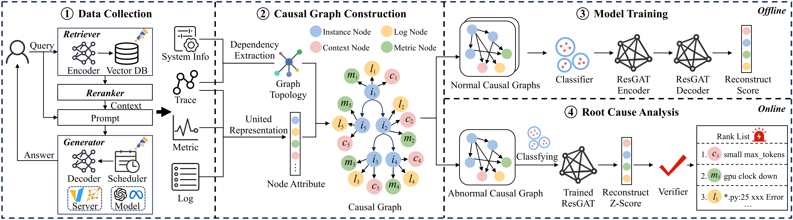

# 🔍 LLMRCA

## 🚀 Getting Started

```bash
# Install dependencies
git clone https://github.com/floritange/LLMRCA.git
cd LLMRCA
pip install -r requirements.txt
pip install -e .

# Run the RCA algorithm
cd ./llmrca/rca_algorithm
python rca_main.py
```

**LLMRCA: Multilevel Root Cause Analysis for LLM Applications Using Multimodal Observability Data**



## 🌟 What is LLMRCA?

LLMRCA helps you find what's causing problems in your LLM applications. It looks at both:
- ⏱️ **Performance issues**: Slow response times, timeouts
- 🧠 **Quality issues**: Hallucinations, irrelevant answers, poor retrievals

Unlike other tools that only track performance, LLMRCA also checks if your LLM is actually giving good answers - critical for real-world applications.

## 💡 Key Features

- **Multi-level Analysis**: Diagnoses issues at host, component, code, and application levels
- **Handles Unstable Response Times**: Understands that different requests need different processing times
- **No Training Labels Needed**: Works without manual labeling of failures
- **Multimodal Data Processing**: Combines metrics, logs, and traces into one analysis
- **Advanced Graph Neural Network**: Uses Residual Graph Attention networks to spot anomalies
- **Proven Results**: 3.9× more accurate than existing methods for performance issues and 92.86% accurate for quality issues

## 🔧 How It Works

1. **Data Collection**: Gathers system metrics, logs, and traces from all components
2. **Causal Graph**: Builds a map showing how components affect each other
3. **Request Classification**: Groups similar requests to handle varying response times
4. **Anomaly Detection**: Spots unusual patterns using graph neural networks
5. **Root Cause Ranking**: Identifies most likely causes of problems

## 📊 Benchmark Results

LLMRCA outperforms existing methods:
- 3.9× better at finding performance problems
- 92.86% accuracy for quality problems
- Verified with extensive experiments on RAG-enhanced applications


## 📁 Project Structure
```bash
LLMRCA
 ├── llmrca/
 │   ├── rca_algorithm/     # Core detection algorithms
 │   │   ├── rca_main.py      # Main RCA algorithm implementation
 │   │   ├── dnn_models_b.py  # Neural network model definitions
 │   │   └── models/          # Saved trained models
 │   ├── request_server/    # Test servers for data collection
 │   │   ├── server_allstart.py
 │   │   ├── server_rag.py
 │   │   └── metrics_system_all.py
 │   ├── data_process/      # Data processing utilities
 │   │   ├── data_filter.py
 │   │   └── data_extractor.py
 │   ├── fault_injection/   # Fault simulation tools
 │   │   └── main_fi.py
 │   ├── main.py            # Main program entry
 │   └── utils.py           # Common utility functions
 ├── data/                # Data storage
 ├── logs/                # Log files
 ├── paper/               # Research papers and diagrams
 │   └── 2LLMRCA_framework.pdf
 ├── requirements.txt     # Dependency list
 └── setup.py             # Installation configuration
 ```

<!-- ## 🔬 Research -->

<!-- LLMRCA is based on research into LLM application failure patterns. For more details, see the [paper](./paper/2LLMRCA_framework.pdf). -->

<!-- ## 📜 Citation

If you use LLMRCA in your research, please cite our paper:
```
[Citation information will be provided upon publication]
```

## 📫 Contact

For questions or support, please open an issue on this repository. -->
